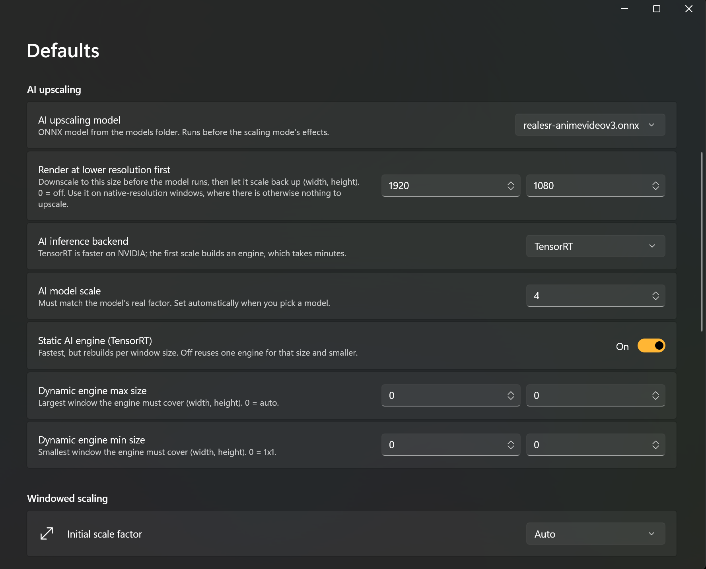
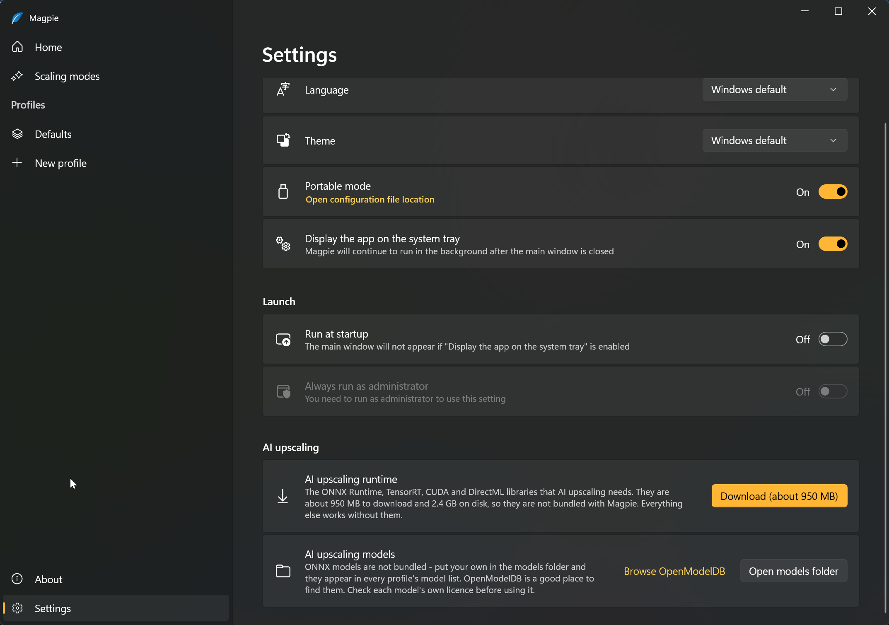
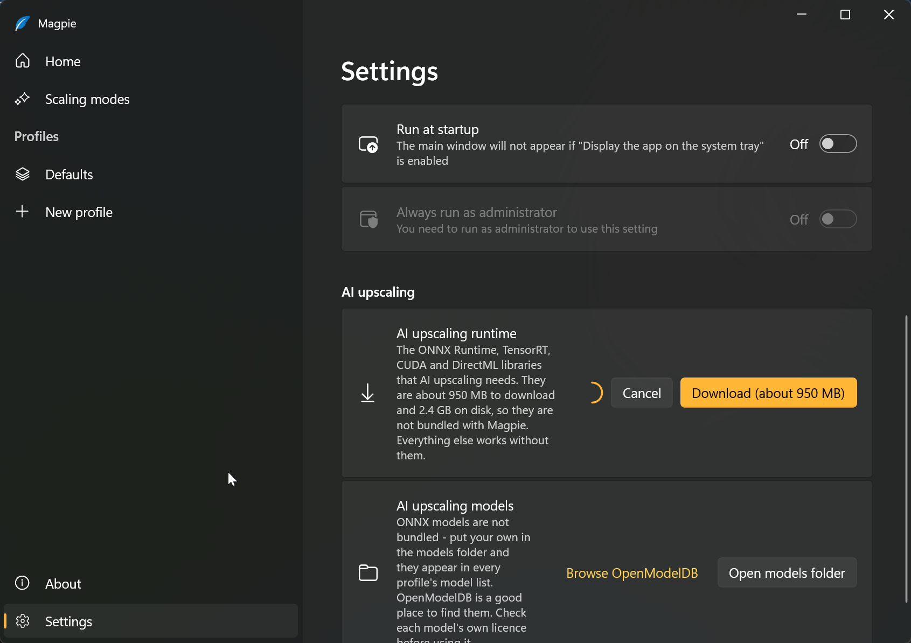
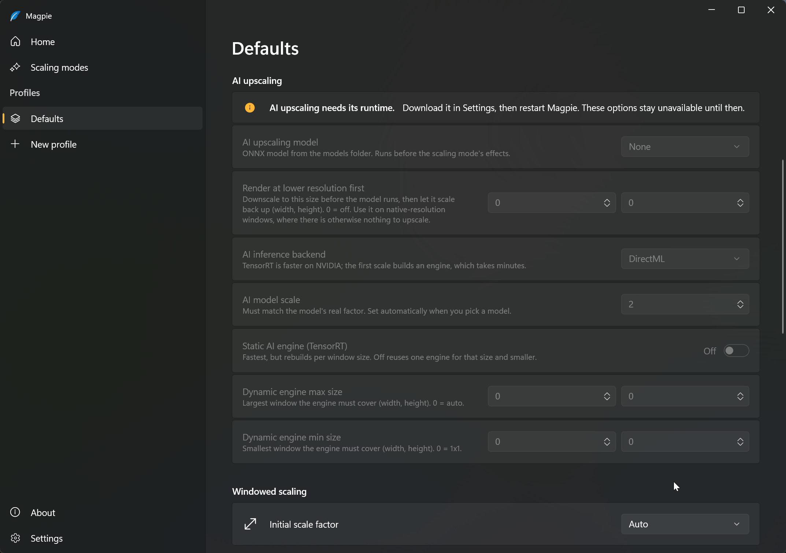

 

  

<h1 align="center">Magpie-TensorRT</h1>

A fork of [Magpie](https://github.com/Blinue/Magpie) that adds **AI upscaling with ONNX models**, running on **TensorRT** or **DirectML**, configurable from inside the app.

Everything Magpie already does is unchanged — this only adds an optional model pass that runs before the scaling mode's effects. Without the runtime installed it behaves exactly like stock Magpie.

Built on Blinue's [`onnx-preview2`](https://github.com/Blinue/Magpie/releases/tag/onnx-preview2) work, ported forward onto the current `dev` tree and finished into something usable day to day. Offered upstream as [Blinue/Magpie#1434](https://github.com/Blinue/Magpie/pull/1434).

👉 [Download](https://github.com/Kristijan1001/Magpie-TensorRT/releases)

---

## Screenshots

Per-game and global AI settings, in the profile system Magpie already has:

Settings — one click to install the runtime, plus a pointer to where models come from:

Downloading, with progress and cancel:

Without the runtime the AI options are disabled rather than broken, and say why:

---

## Getting started

1. Download the [latest release](https://github.com/Kristijan1001/Magpie-TensorRT/releases) and unzip it anywhere.
2. Open **Settings → AI upscaling** and click **Download**. This pulls the runtime (~1 GB compressed, 2.4 GB on disk) from the upstream release assets. It is not bundled because of its size.
3. **Restart Magpie.** The runtime is pinned during startup, so a fresh install only takes effect on the next launch.
4. Put `.onnx` models in the `models` folder next to `Magpie.exe`. **Settings → AI upscaling models** links to [OpenModelDB](https://openmodeldb.info/) and opens the folder.
5. Pick a model in a game's profile, or in **Defaults** for everything.

## Settings

| Setting | What it does |
| --- | --- |
| **AI upscaling model** | The `.onnx` file to run, from `models\` |
| **Render at lower resolution first** | Downscale before the model, then let the effect chain scale back up. `0` = off |
| **AI inference backend** | DirectML or TensorRT |
| **AI model scale** | Must match the model's real factor |
| **Static AI engine** | TensorRT engine fixed to one window size: fastest, but rebuilds when the size changes |
| **Dynamic engine min/max size** | Bounds of the engine's optimisation profile. `0` = auto |

## Things worth knowing

* **The scale must match the model.** A wrong value produces a broken image with no error. `realesr-animevideov3` is x4 despite nothing in its name saying so.
* **The first TensorRT engine build takes minutes.** Progress is reported through the tray icon. Engines are cached per model and resolution, so it is a one-time cost per size — and an engine built for a larger size serves every smaller window.
* **"Render at lower resolution first" is the lever that matters.** Inference dominates the frame time; the D3D11↔CUDA interop is around 0.3% of it. Running the model at 1080p or 1440p instead of native is what makes a fullscreen window worth upscaling at all.
* **Models are not bundled.** Licences differ per model, and several popular community ones are CC-BY-NC or CC-BY-NC-SA and prohibit redistribution. Check each model's own terms.
* **Real-CUGAN works.** It needs its input aligned to a multiple of 4, which the pre-downscale pass handles.

## What this fork changes

* Ports the ONNX/TensorRT backends onto Magpie `dev` (v0.12.x)
* Adds every AI setting to the profile system, so they work per-game and globally
* TensorRT optimisation profiles sized from a resolution ladder instead of a hardcoded 1920x1080 cap, which made anything larger render black
* Engine cache named `<model>_<W>x<H>_<hash>`, so switching models no longer discards the other model's engines
* Optional pre-downscale pass before inference
* Real-CUGAN support via input alignment
* Fixes a startup crash caused by `System32\onnxruntime.dll` (1.17, shipped with Windows ML) winning the DLL search order over the bundled copy
* Failures no longer kill the scaling session or require restarting the app; engine builds and errors are reported through the tray
* In-app runtime installer

## Requirements

* Windows 10 v1903+ or Windows 11
* DirectX feature level 11
* **x64** for AI upscaling — TensorRT and the CUDA runtime have no Windows ARM64 build, so the feature is compiled out there. ARM64 builds are otherwise identical to upstream.
* **NVIDIA GPU** for TensorRT. DirectML works on any DX12 GPU.

## Credit

All of Magpie is [Blinue](https://github.com/Blinue)'s work, including the original ONNX backends this builds on. This fork exists only because these additions are not in upstream; if they land there, use upstream instead.

Thanks to [Weblate](https://weblate.org) for hosting Magpie's translations.

## License

[GPL-3.0](./LICENSE), same as upstream.
